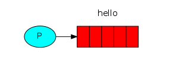
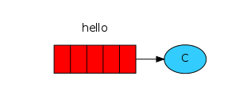
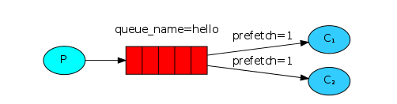
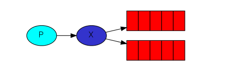
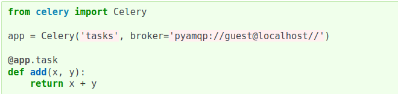

# Rabbit MQ and Celery

# [Rabbit MQ](https://www.rabbitmq.com)

### 1 - Intro

RabbitMQ is a message broker written in Erlang: it accepts and forwards messages using Advanced Message Queuing Protocol (AMQP). You can think about it as a post office: when you put the mail that you want posting in a post box, you can be sure that Mr. or Ms. Mailperson will eventually deliver the mail to your recipient. In this analogy, RabbitMQ is a post box, a post office and a postman.

A producer (sender) that sends a single message, and a consumer (receiver) that receives messages and prints them out. It's a "Hello World" of messaging.

In the diagram below, "P" is our producer and "C" is our consumer. The box in the middle is a queue - a message buffer that RabbitMQ keeps on behalf of the consumer.

A receiver will receive messages from the queue.

### 2 - Queues

The main idea behind Work Queues (aka: Task Queues) is to avoid doing a resource-intensive task immediately and having to wait for it to complete. Instead we schedule the task to be done later. We encapsulate a task as a message and send it to the queue. A worker process running in the background will pop the tasks and eventually execute the job. When you run many workers the tasks will be shared between them.

One of the advantages of using a Task Queue is the ability to easily parallelise work. If we are building up a backlog of work, we can just add more workers and that way, scale easily.

But our tasks will still be lost if RabbitMQ server stops.

When RabbitMQ quits or crashes it will forget the queues and messages unless you tell it not to. Two things are required to make sure that messages aren't lost: we need to mark both the queue and messages as durable.

In a situation with two workers, when all odd messages are heavy and even messages are light, one worker will be constantly busy and the other one will do hardly any work. Well, RabbitMQ doesn't know anything about that and will still dispatch messages evenly.

This happens because RabbitMQ just dispatches a message when the message enters the queue. It doesn't look at the number of unacknowledged messages for a consumer. It just blindly dispatches every n-th message to the n-th consumer.

### 3 - Pub/Sub

The core idea in the messaging model in RabbitMQ is that the producer never sends any messages directly to a queue. Actually, quite often the producer doesn't even know if a message will be delivered to any queue at all.

Instead, the producer can only send messages to an exchange. An exchange is a very simple thing. On one side it receives messages from producers and the other side it pushes them to queues. The exchange must know exactly what to do with a message it receives. Should it be appended to a particular queue? Should it be appended to many queues? Or should it get discarded. The rules for that are defined by the exchange type.

There are a few exchange types available: **direct**, **topic**, **headers** and **fanout**.

- Fanout:

The fanout exchange, as you can probably guess from the name, it just broadcasts all the messages it receives to all the queues it knows.

# [Celery](https://docs.celeryproject.org/en/stable/#)

### 1 - Intro

A task queue’s input is a unit of work called a task. Dedicated worker processes constantly monitor task queues for new work to perform.

Celery communicates via messages, usually using a broker to mediate between clients and workers. To initiate a task the client adds a message to the queue, the broker then delivers that message to a worker.

A Celery system can consist of multiple workers and brokers, giving way to high availability and horizontal scaling.

Celery is written in Python.

Celery requires a message transport to send and receive messages. The RabbitMQ and Redis broker transports are feature complete, but there’s also support for a myriad of other experimental solutions, including using SQLite for local development.

### 2 - App

The first thing you need is a Celery instance. We call this the Celery application or just app for short. As this instance is used as the entry-point for everything you want to do in Celery, like creating tasks and managing workers, **it must be possible for other modules to import it**.

You can now run the worker by executing our program with the worker argument.

`$ celery -A tasks worker`

# [Flower](https://flower.readthedocs.io/en/latest/)

Web based tool for monitoring and 
administrating Celery clusters.

Task progress and history.

Ability to show task details (arguments, start time, runtime, and more).

Graphs and statistics.

# Putting it all together

Prepare the environment:

`$ ./setup.sh`

`$ cd demo/`

Start rabbit:

`$ ./rabbit.sh`

Start worker #1:

`$ ./worker1.sh`

Start worker #2:

`$ ./worker2.sh`

Start flower:

`$ ./flower.sh`

Run app:

`$ ./app.py`

Monitor the queues and workers on:

- RabbitMQ: [localhost:15762](localhost:15762)
- Flower: [localhost:5555](localhost:5555)

# Referências

- [RabbitMQ Tutorials](https://www.rabbitmq.com/getstarted.html)
- [Celery Documentation](https://docs.celeryproject.org/en/stable/getting-started/introduction.html)
- [Flower Documentation](https://flower.readthedocs.io/en/latest/)
